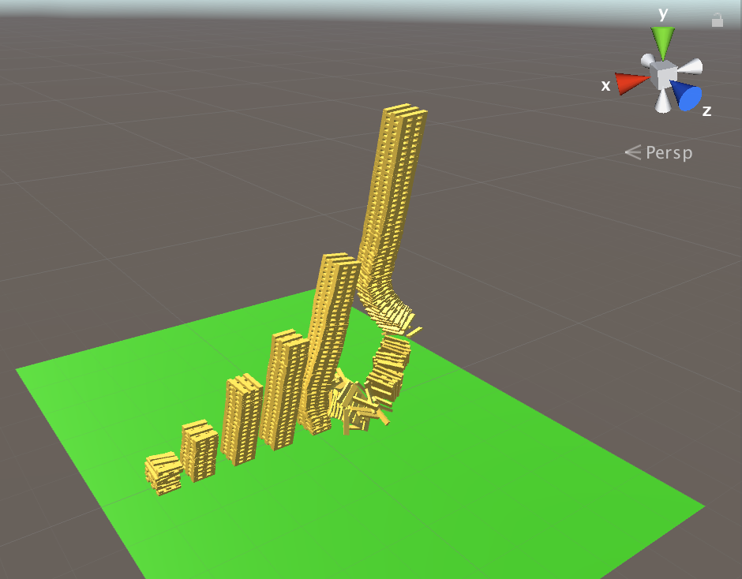

# Bullet Physics Experiment

A second experiment after <https://github.com/geluso/unity-tower-physics-experiment>.

This repo is designed to practice importing Unity Bullet Physics from the
Asset Store and seeing how to use the alternate Physics engine and seeing
if it improves stability of stacked tower planks and cubes.

